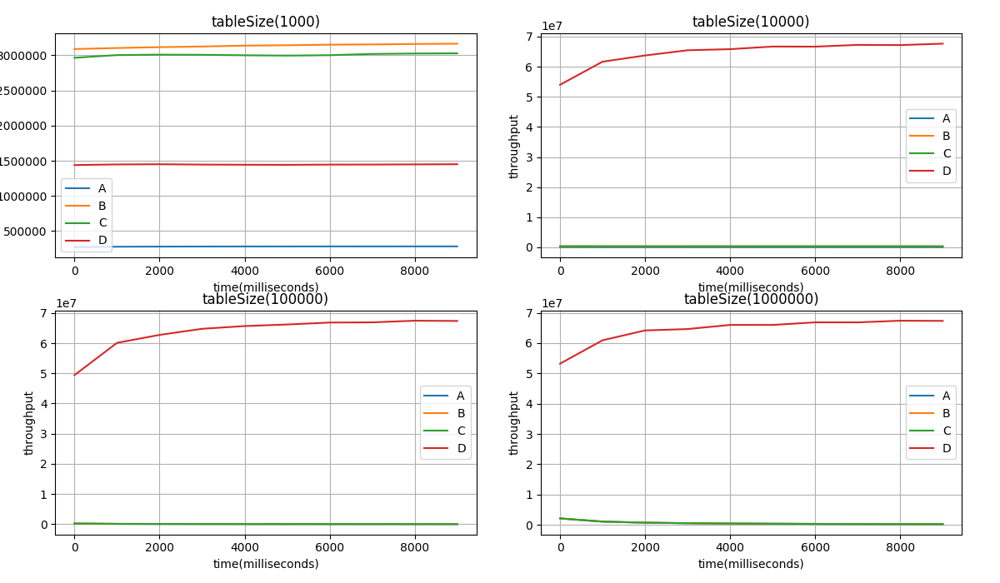
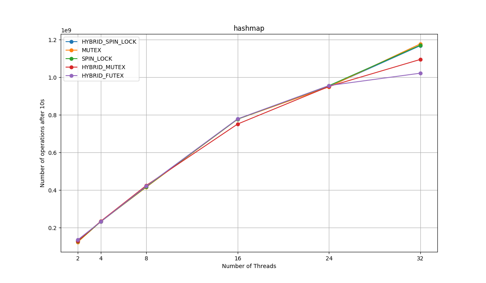
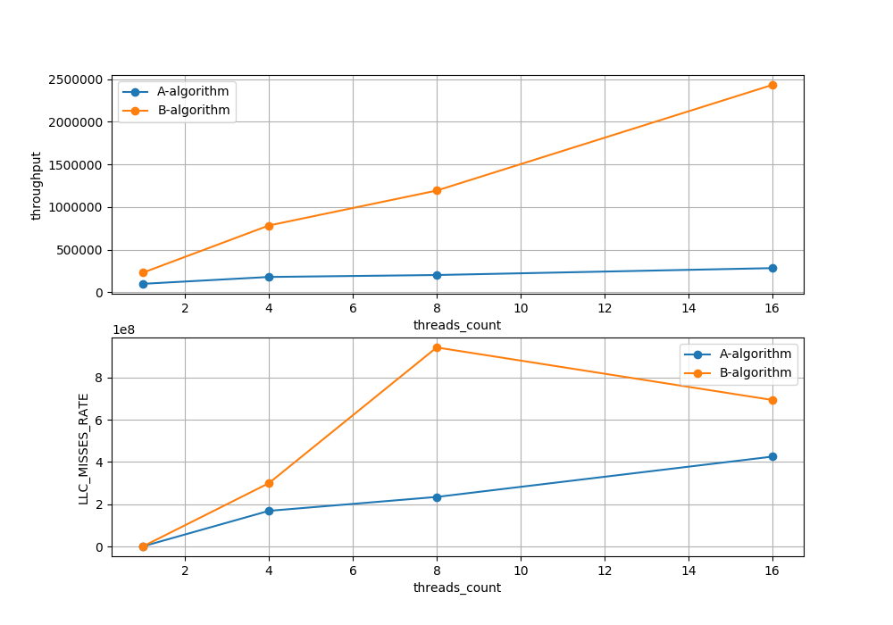

# expandable-lock-free-hashtable
implementation of a concurrent probing hashtable.
Each of this methods that have been implement ed in this repository are linearizable. 

- file alg_a.h: [A algorithm] Implements a concurrent hashtable that each slot has its lock (fine-grain locking approach). 
- file alg_b.h: [B algorithm] Implements fine-grain locking after finding a slot.
- file alg_c.h: [C algorithm] Implements a lock-free non-expandable hash-table using Atomic and CAS instructions.
- file alg_d.h: [D algorithm] Implements a fast expandable lock-free hashtable based on this [paper](https://arxiv.org/abs/1601.04017).
- file alg_aa.h: Implements a non-expandable hashtable with respect to different locks such as Spin-locks (k42, atomic-locks, and ...) and Mutexes (blocking-locks). 

Benchmark was provided by [Prof. Trever Brown ](http://tbrown.pro). 

## Start
```bash
  make USER_DEFINES="-DMUTEX" all -j && LD_PRELOAD=./libjemalloc.so (perf stat/record -e YOUR_DESIRED_EVENTS such as LLC-stores,LLC-store-misses,LLC-loads,LLC-load-misses) (taskset/numactl -c YOUR_CPU_CORES) ./benchmark or ./benchmark_debug (enables debuging defines)
   -a  [string]   [a]lgorithm name in { A, AA, B, C, D }
   -sT [int]      size of initial hash [T]able
   -m  [int]      [m]illiseconds to run ;
   -sR [int]      size of the key [R]ange that random keys will be drawn from (i.e., range [1, s])
   -t  [int]      number of [t]hreads that will perform inserts 
```

## Results

Comparing algorithms A, B, C, D with respect to different table sizes:



Performace of hashtable with respect to the different locks


Comparing performance of A,B algorithms to show that position of acquiring a lock is important.


## Todo List

- Implementing a memory reclamation method (such as EBR (debra, debra+),  haphazard pointer) for D algorithm. 
- Implementing AMD Hardware transaction memory instead of lock-free algorithms. 
